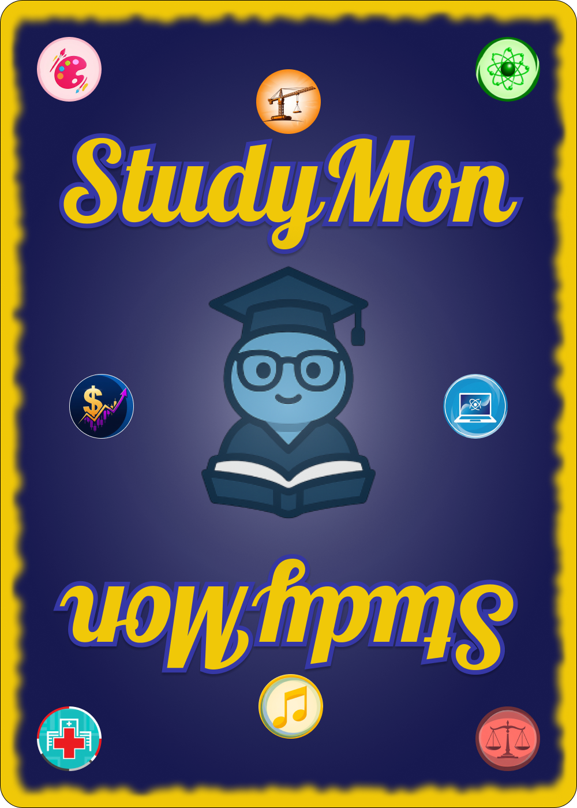
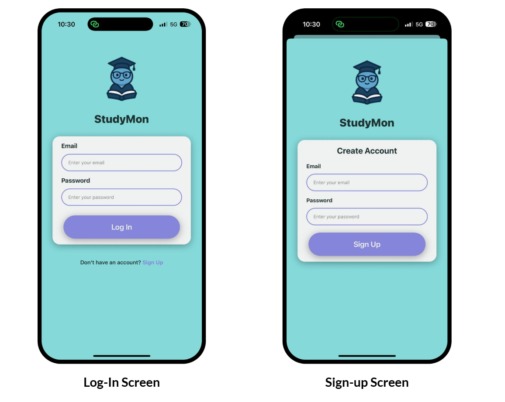
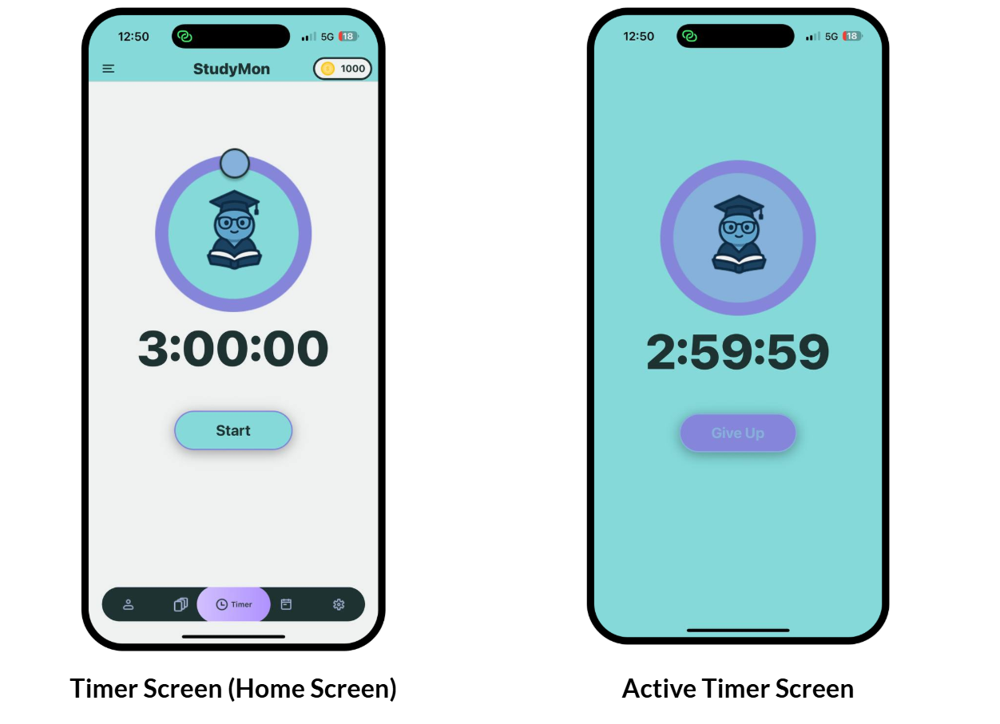
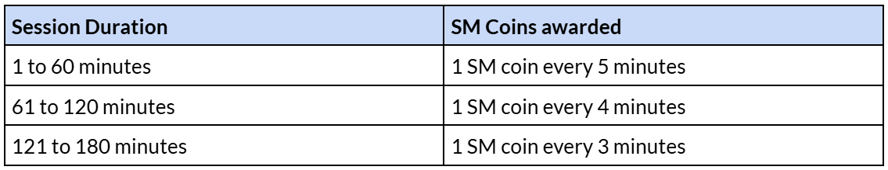
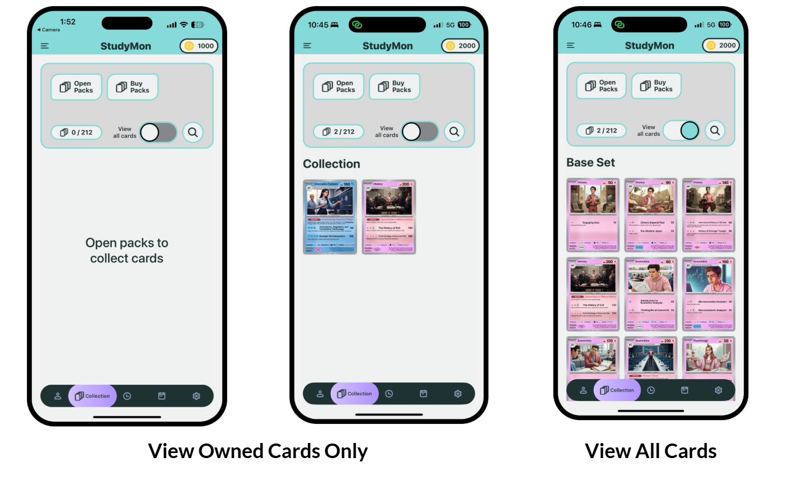
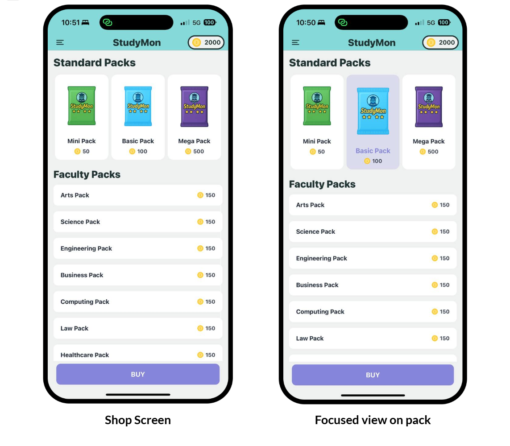
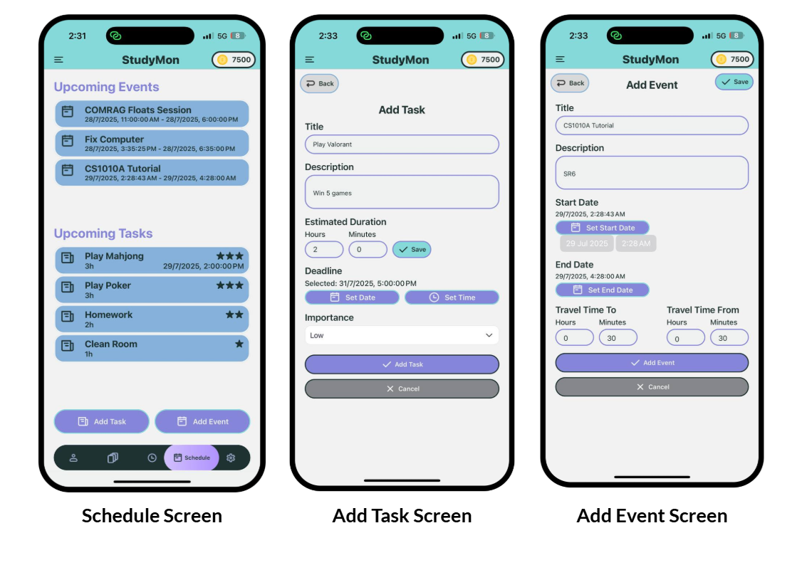
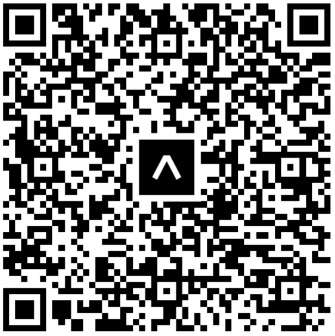
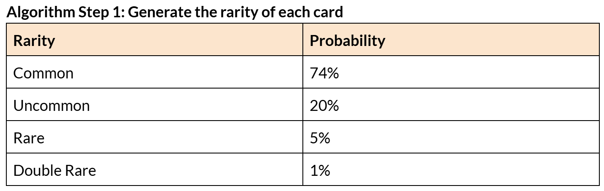
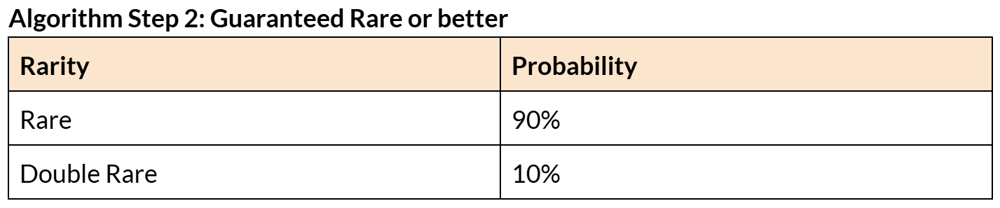

# StudyMon

> **NUS Orbital 2025 - Apollo 11 Level of Achievement**

<p align="center">
  
</p>

**StudyMon** is a gamified productivity mobile application designed to help students stay focused and motivated. By combining a strict focus timer, an intelligent task scheduler, and a collectible trading card reward system, StudyMon turns studying into an engaging experience.

## 📖 Table of Contents
- [Problem Statement](#problem-statement)
- [Core Features](#core-features)
- [Tech Stack](#tech-stack)
- [Getting Started](#getting-started)
- [Gamification Mechanics](#gamification-mechanics)
- [Algorithms & Logic](#algorithms--logic)
- [The Team](#the-team)

## 🧐 Problem Statement

We recognize how difficult it can be to study continuously without frequent distractions from our phones. It can be tempting to take a quick look at our devices while studying, breaking our focus and decreasing our productivity. StudyMon provides a solution to mitigate this issue by motivating students to study more frequently and with better focus.

**The Core Loop:**
- **Focus:** Use the timer to study without leaving the app.
- **Schedule:** Add tasks and events to your schedule, and the app will recommend which tasks to work on first
- **Earn:** Receive "StudyMon Coins" based on your focus duration.
- **Collect:** Spend coins on Card Packs to collect NUS-themed trading cards.


## ✨ Core Features

### 1. 🔐 **User Authentication:** Secure Email/Password login and registration via Firebase

<p align="center">
  
  <br>
  <em>Login and Signup Screens</em>
</p>

### 2. ⏱️ **Study Timer:** A strict timer (up to 3 hours) that rewards currency upon completion of study sessions.

<p align="center">
  
  <br>
  <em>Timer Screen</em>
</p>

### 3. 🪙 **In-game Currency Rewards:** for completed focus sessions

<p align="center">
  
  <br>
  <em>Reward Table</em>
</p>

### 4. 🃏 **Collectible Trading Card System:** Collect over 150 unique cards including Students, Items, Equipment, Professors, and Locations

<p align="center">
  
  <br>
  <em>Collection Interface</em>
</p>


### 5. 🛍️ **Card Pack Shop:** Exchange earned coins for various tiers of Card Packs

<p align="center">
  
  <br>
  <em>Shop Screen</em>
</p>

### 6. 📅 **Task & Event Scheduling Interface:** With algorithmic sorting of tasks and events to prioritize deadlines and importance

<p align="center">
  
  <br>
  <em>Schedule Screen</em>
</p>

### 7. 📊 **Profile & Productivity Statistics**


### 8. 👥 **Friend System**


## 🛠️ Tech Stack

**Frontend:**
* [React Native](https://reactnative.dev/)
* [Expo](https://expo.dev/)
* Tailwind CSS (Nativewind)

**Backend & Database:**
* [Firebase Authentication](https://firebase.google.com/products/auth)
* [Firestore](https://firebase.google.com/docs/firestore) (NoSQL Database)

**Design & Tools:**
* Figma (UI/UX)
* Git & GitHub (Version Control)
* Generative AI (ChatGPT & Gemini) for card asset generation

## 🚀 Getting Started

### Method 1: Expo Go (For User Testing)
1.  Download the **Expo Go** app from the App Store or Google Play Store.
2.  Scan the QR code below.

<p align="center">
  
</p>

3.  Login with the test credentials below or sign up as a new user.

### Method 2: Local Development
To run this project locally:

1.  **Clone the repo**
    ```bash
    git clone https://github.com/calvin4370/studymon.git
    ```

2.  **Install dependencies**
    ```bash
    npm install
    ```

3.  Create a .env file with your Firebase configuration:
    ```js
    FIREBASE_API_KEY="..."
    FIREBASE_AUTH_DOMAIN="..."
    FIREBASE_PROJECT_ID="..."
    ```

4.  **Start the server**
    ```bash
    npx expo start
    ```

### 🧪 Test Accounts
You can use these Developer Accounts to test functionality without creating a new user:

| Email | Password | Remarks |
| :--- | :--- | :--- |
| `email@email.com` | `password` | Developer Account |
| `test1@email.com` | `password` | Full Card Collection |

## 🎲 Gamification Mechanics

### Earning StudyMon Coins
Upon completion of a study session, StudyMon Coins are given to the user depending on how long the timer was set to, according to the following table. The rate of SM coins awarded is different for the first, second and third hour within the same timer session.

<p align="center">
  
  <br>
  <em>Reward Table</em>
</p>

For example, a user who completed a 1h 30min study session with the timer will receive 12 SM coins for the first hour and 7 SM coins for the next 30 minutes for a total reward of 19 SM coins for the session. This system encourages users to commit to longer study sessions, thus improving focus and efficiency of study sessions.

However, to prevent misuse of the timer to gain large amounts of SM coins while one is not actually studying, such as when users are sleeping, we set the maximum timer duration to 3 hours. This also encourages users to take breaks in between study sessions  which can improve productivity.


### Card Rarity System
Each pack contains 5 cards, with each card having an independent probability to be of a certain rarity. The table below illustrates how cards are determined each time a user opens a pack.

<p align="center">
  
</p>

In addition, each pack has a guaranteed chance to contain at least a Rare or better. If the first step of the algorithm does not produce any Rare or better cards, one of the cards will be replaced by a guaranteed Rare or Double Rare according to the following table:

<p align="center">
  
</p>

## 🧠 Algorithms & Logic

### Intelligent TaskSort
StudyMon uses a custom `taskPriorityComparator` to dynamically rank user tasks. It doesn't just sort by date; it weighs multiple factors:

1.  **Immediate Fail State:** Tasks that will be failed if not done *now*.
2.  **Urgency:** Tasks with very close deadlines.
3.  **Importance:** Ranked by user setting (High > Medium > Low).
4.  **Deadline:** Standard chronological sorting.

This ensures that the "Upcoming Tasks" view always presents the optimal completion order to the student.

## 👥 The Team

**NUS Orbital 2025 - Team 7236**

* **Chan Jun Jie** - *Year 1 Business Analytics*
* **Gabriel Simundo Ponce** - *Year 1 Computer Science*

## 📄 License
Distributed under the MIT License. See `LICENSE` for more information.

## 🙏 Acknowledgements
* Project done as part of NUS Orbital 2025
* Card templates inspired by the Pokémon TCG
* Assets generated using **ChatGPT** and **Gemini**

Below is an example template prompt we use to generate most of our card arts.
>Generate 5 new pictures of a year [YEAR] NUS [male/female] [COURSE] student. Don't give me a generic student wearing a shirt that says NUS or [COURSE] on it, I don't want any title with the descriptions on the images. Give them nice clothes with an [COLOUR] colour theme. I want details that show they are a [FACULTY] student studying [COURSE]. Make them seem [DESCRIPTIVE DETAILS]. Give me a full picture image with NO weird white banners. I want the 5 pictures in digital art theme and rectangular format.
